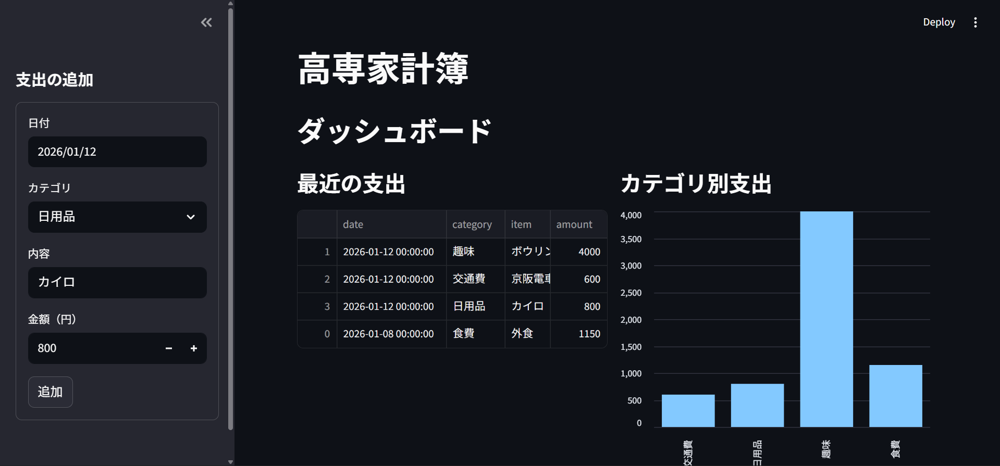
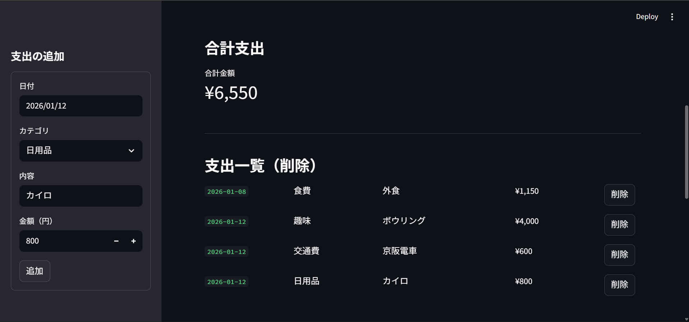
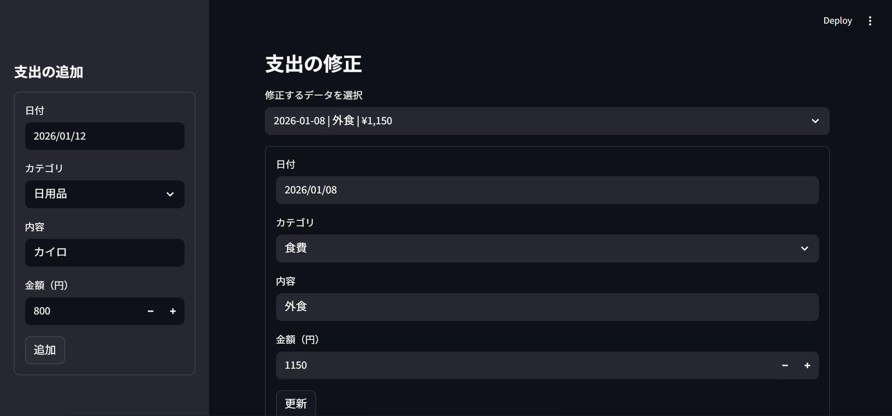
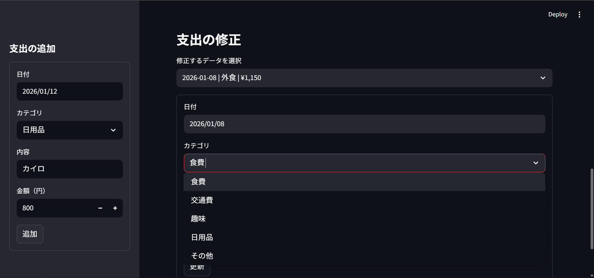
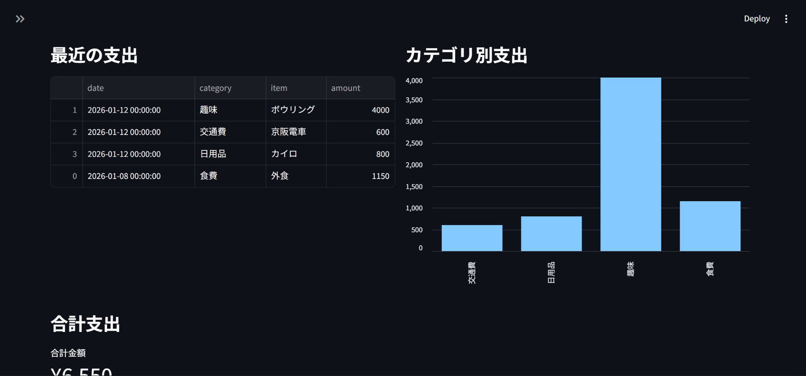

# 家計簿アプリ（Household Account App）

Python と Streamlit を用いて制作した、シンプルな家計簿管理アプリです。  
日々の支出を記録し、一覧表示やカテゴリ別の集計を通して支出傾向を可視化することを目的としています。

---

## 制作時期

**2025年12月 ～ 2026年1月**

---

## 作品の説明

本作品は、Python 授業で学習した内容の総まとめとして制作した家計簿アプリです。  
ユーザーが日常生活で発生する支出を「日付・カテゴリ・内容・金額」という基本的な情報として入力し、それらを蓄積・管理できるよう設計しました。入力されたデータは CSV ファイルとして保存され、アプリを再起動しても内容が保持される仕組みになっています。

アプリの画面構成は、左側に支出を入力するフォーム、右側に支出の一覧や分析結果を表示するダッシュボードという構成になっています。これにより、操作性と視認性の両立を意識しています。また、支出データは集計処理を行い、カテゴリ別の合計金額を棒グラフとして表示することで、どの分野にどれだけお金を使っているかを直感的に把握できるようにしました。

実装にあたっては、処理を一つのファイルにまとめるのではなく、**クラス設計**と**ファイル分割**を行い、保守性と可読性の高い構成を目指しました。具体的には、取引データを表すクラス、データの読み書きを管理するクラス、画面表示を担当するファイルを分離しています。これにより、今後機能を拡張する際にも修正箇所を限定しやすい構成となっています。

本アプリは支出管理に特化したシンプルな構成ですが、プログラムの基礎構文、ライブラリの活用、GitHub を用いたプロジェクト管理など、これまでに学習した内容を総合的に活用した作品となっています。

---

## 使用技術・ライブラリ

- Python  
- Streamlit  
- Pandas  
- Git / GitHub  

---

## スクリーンショット







---

## 実行方法

1. このリポジトリをクローンまたは ZIP でダウンロードします。

```bash
git clone https://github.com/ToTi-Hub/household_account_app.git
プロジェクトのルートディレクトリに移動します。

bash
コードをコピーする
cd household_account_app
必要なライブラリを requirements.txt からインストールします。

bash
コードをコピーする
pip install -r requirements.txt
以下のコマンドを実行してアプリを起動します。

bash
コードをコピーする
streamlit run main.py
ブラウザが自動的に起動し、家計簿アプリが表示されます。

製作者
結石 敏矢

GitHub: https://github.com/ToTi-Hub